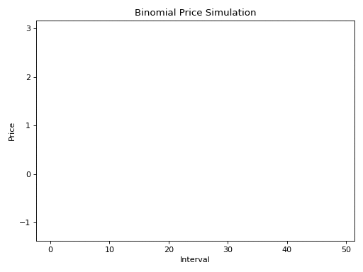
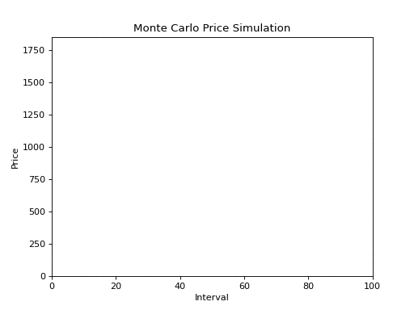

# Monte Carlo Portfolio Simulation Framework

## Setup

### Mac / Linux

1. `sudo apt-get update`
2. `$ sudo apt-get install imagemagick`
3. `pip install -r requirements.txt`


### Windows Subsystem for Linux

1. Download and install [Xming](https://sourceforge.net/projects/xming/)
2. `sudo apt-get update`
3. `sudo apt-get install python3.6-tk` 
    - you may have to install a different python*-tk depnding on the python version you're using
4. `$ sudo apt-get install imagemagick`
5. `pip install -r requirements.txt`
6. `export DISPLAY=localhost:0.0`
    - add to ~/.bashrc to make permanent

## Usage

- Customize portfolio in ```./portfolio.py```

- `python3 main.py`

## Examples

- Single asset simulation with 0.50 probability of price increase at each interval



- 100 simulations over 100 time intervals


